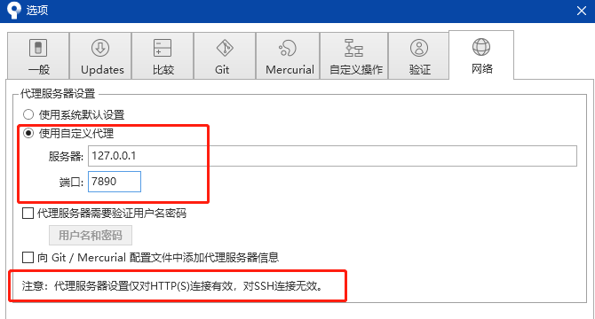

# Git

## git使用多个仓库

使用`sourcetree`，进入仓库，设置，远程仓库

## git clone 加速

### windows

ssh方式克隆和http方式克隆加速只能选1个

+ 配置使用代理

  **代理端口号根据自己得端口修改**

  + ssh

    ```shell
    # socks5协议，1080端口修改成自己的本地代理端口
    git config --global http.https://github.com.proxy socks5://127.0.0.1:7890
    git config --global https.https://github.com.proxy socks5://127.0.0.1:7890
    ```

  + http

    ```shell
    # http协议，1081端口修改成自己的本地代理端口
    git config --global http.https://github.com.proxy https://127.0.0.1:7890
    git config --global https.https://github.com.proxy https://127.0.0.1:7890
    ```

+ 查看配置

  ```sh
  git config -l
  ```
  
+ 重置代理设置

  ```shell
  git config --global --unset http.proxy
  git config --global --unset https.proxy
  ```

### sourceTree

`首选项`->`网络`

 

### wsl

+ wsl1中与windows方式相同

+ wsl2中，子系统与windows不再共用网段，暂时未找到合适得方式

  


## 问题记录

### HTTP方式clone失败

+ 提示信息

  ```shell
  fatal: unable to access 'http://192.168.66.254/G_TechnicalService/bidding-bigdata.git/': Failed to connect to 127.0.0.1 port 1086: Connection refused
  ```

+ 解决方案

  执行如下命令

  ```shell
  $ git config --global http.proxy
  ```

### 多远程仓库无法提交与拉取

> 当1个本地仓库配置多个远程仓库时，后添加的远程仓库一般都会无法pull和push，此时使用如下命令进行强行push

```shell
git push -u gitlab master -f
```

