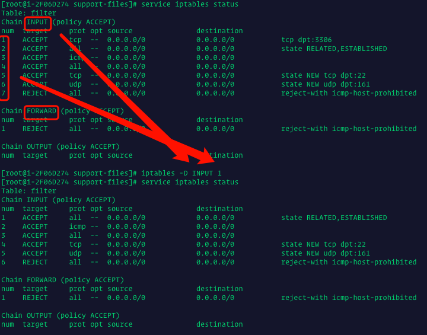
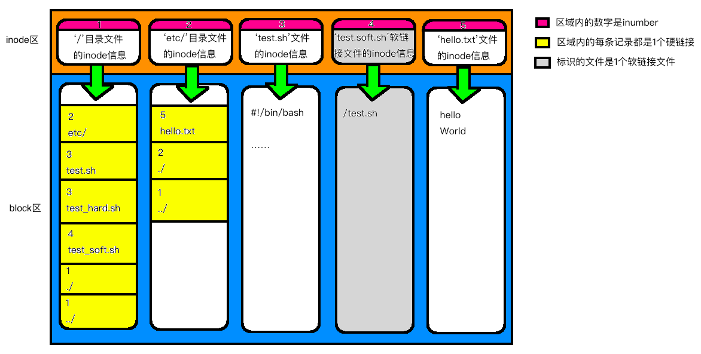

# Linux笔记

## 常用命令

### cat

+ 功能

  + `cat file1 file2`

    cat后面必须是已存在文件，表示将这些文件内容打印出来

    ```shell
    will$ cat test2.xml 
    123
    :wq
    ```

  + `cat >file`

    该命令执行后，会让你输入文件内容，该命令表示将从键盘输入的内容保存到这个文件中，该文件没有则创建，有则覆盖

    ```shell
    will$ cat >test1
    123
    ^C
    will$ cat test1 
    123
    ```

  + `cat file1 file2 >file`

    将`file1`加上`file2`中的内容保存到`file`中

    ```shell
    will$ cat test1 >test2
    will$ ls
    GitHub	books	test1	test2
    will$ cat test2
    123
    ```

+ 参数

  + -A, --show-all           等价于 -vET
  + -b, --number-nonblank    对非空输出行编号
  + -e                       等价于 -vE
  + -E, --show-ends          在每行结束处显示 $
  + -n, --number     对输出的所有行编号,由1开始对所有输出的行数编号
  + -s, --squeeze-blank  有连续两行以上的空白行，就代换为一行的空白行 
  + -t                       与 -vT 等价
  + -T, --show-tabs          将跳格字符显示为 ^I
  + -u                       (被忽略)
  + -v, --show-nonprinting   使用 ^ 和 M- 引用，除了 LFD 和 TAB 之外

### curl

> 该命令是用于文件上传及下载的命令

+ 功能

  + `curl URL`

    下载文件并显示到终端，但是不保存

  + `curl URL -O`

    下载文件并保存在当前文件夹下

  + `curl URL -o filename`

    下载文件并保存在指定的文件中

+ 参数

  更多参数参见[curl详解](http://man.linuxde.net/curl)

### tail

> 用于显示文件最后几行

+ 功能

  + `tail file`

    显示文件最后10行

  + `tail 20 file`

    显示文件最后20行

  + `tail +20 file`

    显示文件第20行到最后的内容

+ 参数

  ```
  --retry：即是在tail命令启动时，文件不可访问或者文件稍后变得不可访问，都始终尝试打开文件。使用此选项时需要与选项“——follow=name”连用；
  -c<N>或——bytes=<N>：输出文件尾部的N（N为整数）个字节内容；
  -f<name/descriptor>或；--follow<nameldescript>：显示文件最新追加的内容。“name”表示以文件名的方式监视文件的变化。“-f”与“-fdescriptor”等效；
  -F：与选项“-follow=name”和“--retry"连用时功能相同；
  -n<N>或——line=<N>：输出文件的尾部N（N位数字）行内容。
  --pid=<进程号>：与“-f”选项连用，当指定的进程号的进程终止后，自动退出tail命令；
  -q或——quiet或——silent：当有多个文件参数时，不输出各个文件名；
  -s<秒数>或——sleep-interal=<秒数>：与“-f”选项连用，指定监视文件变化时间隔的秒数；
  -v或——verbose：当有多个文件参数时，总是输出各个文件名；
  --help：显示指令的帮助信息；
  --version：显示指令的版本信息。
  ```

+ `tail -f`

  > 将该命令指定的文件中实时被追加的信息实时输出到控制台
  >
  > 参见[将执行程序的打印信息存储到文件](#将执行程序的打印信息存储到文件)

### top、htop

> 这两个命令都是用来查看系统运行情况和进程的，htop比top更先进，但是htop需要自己安装
>
> cpu、内存、交换等信息

### aliac

> 为一个指令指定别名，只对当前登录有效

例：

	`alias cb='cd /Users/will/'`

### df

> 查看磁盘分区

## 常用软件安装

### mysql

> Centos

+ YUM方式

  + 安装

    参见[YUM方式安装mysql](https://blog.csdn.net/lihao21/article/details/80692068) 

  + 重启mysql

    ```
    systemctl stop mysqld.service
    ```

  + 开机自动启动

    ```
    systemctl enable mysqld.service
    ```

+ 压缩包方式

  + 安装

    参见[解压缩方式安装mysql](https://blog.csdn.net/vipbupafeng/article/details/80271089) 

### node

> Centos

+ 安装

  安装EPEL（linux企业版额外软件包）

  ```
  yum install epel-release
  ```

  > 不安装EPEL会导致安装nodejs后没有npm

  安装nodejs、npm

  ```
  yum install nodejs
  ```

  > 此时安装后node版本一般为`6.*`版本，需要升级

  安装nodejs管理工具`n`

  ```
  npm install -g n
  ```

  升级node

  ```
  sudo n latest
  ```

+ 卸载

  ```
  yum remove nodejs npm -y
  ```

  > - 进入 /usr/local/lib 删除所有 node 和 node_modules文件夹
  > - 进入 /usr/local/include 删除所有 node 和 node_modules 文件夹
  > - 检查 ~ 文件夹里面的"local" "lib" "include" 文件夹，然后删除里面的所有 "node" 和 "node_modules" 文件夹
  > - 可以使用以下命令查找 `$ find ~/ -name node` `$ find ~/ -name node_modules`
  > - 删除: /usr/local/bin/npm
  > - 删除: /usr/local/share/man/man1/node.1
  > - 删除: /usr/local/lib/dtrace/node.d
  > - 删除: rm -rf /home/[homedir]/.npm
  > - 删除: rm -rf /home/root/.npm

### shadowsocks

+ 参见：[centos翻墙](https://bodyno.com/tool/2017/09/03/centos-ss.html)

### tmux

+ 安装

  参见：[tmux安装](https://www.jianshu.com/p/f519df6ac8a8)

  最后执行`make install`

## 常用操作

### 修改环境变量

1. 对所有用户生效

   ```shell
   vim /etc/profile
   ```

   > 将如下内容添加都文件最后

   ```
   PATH=/usr/local/webserver/php/bin:$PATH
   export PATH
   ```

   > 其中路径是要添加的程序所在的路径
   >
   > 然后退出vim

   ```
   source /etc/profile
   ```

2. 对当前用户生效

   > + 这种方法对root用户貌似没有效果
   > + 将上述方法中的`/etc/profile`替换为`~/.bash_profile`即可

3. 只对当前会话有效（临时）

   > 执行如下命令

   ```shell
   export PATH=/usr/local/webserver/php/bin:$PATH
   ```

### 安装系统后的root用户密码

> 安装linux系统后，有时会出现使用安装系统时的密码登录root用户不成功的问题，尝试下面方法

```shell
linuxidc@ubuntu:~$ sudo passwd
[sudo] password for linuxidc: 
输入新的 UNIX 密码： 
重新输入新的 UNIX 密码： 
passwd：已成功更新密码
linuxidc@ubuntu:~$
```

### 将执行程序的打印信息存储到文件

> 将执行某个程序过程中控制台的打印信息存储到文件，可以通过如下操作进行
>
> 如：执行`test`脚本

```shell
./test > test.log
```

> 将`test`脚本执行过程中的打印存储到`test.log`文件中
>
> 此时可以通过`tail -f`命令实时监控该文件中被追加的信息

```shell
tail -f test.log
```

> 此时，如果`test.log`文件中被追加了内容，会立即显示在控制台上

### 防火墙

#### centos7

+ 临时开启防火墙

  ```shell
  $ systemctl start  firewalld
  ```

+ 临时关闭防火墙

  ```shell
  $ systemctl stop  firewalld
  ```

+ 重启防火墙

  ```shell
  $ systemctl restart  firewalld
  ```

+ 查看防火墙是否开启

  ```shell
  $ firewall-cmd --state
  # 或
  $ systemctl status firewalld
  ```

+ 禁止开启启动

  ```shell
  $ systemctl disable firewalld
  ```

+ 允许开机启动

  ```shell
  $ systemctl enable firewalld
  ```

+ 开放端口

  ```shell
  $ firewall-cmd --zone=public --add-port=80/tcp --permanent
  $ systemctl restart  firewalld
  ```

+ 关闭已开放端口

  ```shell
  $ firewall-cmd --zone=public --remove-port=80/tcp --permanent
  $ systemctl restart  firewalld
  ```

+ 查看端口状态

  ```shell
  $ firewall-cmd --query-port=80/tcp
  ```

#### iptables

> Iptables 的配置最终会保存在`/etc/sysconfig/iptables`中

+ 临时关闭

  ```shell
  service iptables stop
  ```

+ 临时开启

  ```shell
  service iptables start
  ```

+ 重启

  ```shell
  service iptables restart
  ```

+ 禁止开机启动

  ```shell
  chkconfig iptables off
  ```

+ 允许开机启动

  ```shell
  chkconfig iptables on
  ```

+ 开放端口

  ```shell
  iptables -I INPUT -p tcp --dport 80 -j ACCEPT
  ```

+ 查看端口状态、查看防火墙是否开启

  ```shell
  service iptables status
  ```

+ 关闭端口

  > 先查看要关闭的端口，然后根据类型、num删除那条记录即可

  ```shell
  iptables -D [类型] [num]
  ```

   

+ 保存端口配置

  ```shell
  service iptables save
  ```


## 系统概念

### 文件存储结构

+ 硬盘格式化的时候，操作系统自动将硬盘分成两个区域：

  + block区：存放文件数据；

    > 查看1个文件在block区的内容直接vim即可

  + inode区：存放inode所包含的信息。

+ inode

  > inode是用来存放文件的元信息的，如：作者，创建时间，权限等
  >
  > inode包含的信息如下：
  >
  > - 文件的字节数
  > - 文件拥有者的User ID
  > - 文件的Group ID
  > - 文件的读、写、执行权限
  > - 文件的时间戳，共有三个：ctime指inode上一次变动的时间，mtime指文件内容上一次变动的时间，atime指文件上一次打开的时间。
  > - 链接数，即有多少文件名指向这个inode
  > - 文件数据block的位置
  >
  > 查看1个文件在inode区的内容，使用`stat`命令

  + inumber

    > - 每个inode就有1个inumber，用来标识inode的位置
    >
    > - 查看inumber命令`ls -i`

  + inode大小

    > inode节点的总数，在格式化时就给定，当磁盘内存放的都是小文件时，可能会出现inode已经用尽，但是磁盘还没存满的情况

+ linux中，任何1个文件在磁盘上都是由1个`inode`和1个`block`组成的

  目录也是文件，不过该文件内容是该目录下的文件列表，该目录下的每个文件都会以`inumber`+`文件名`的形式被记录在该目录文件的列表中

  > 因此：
  >
  > + 1个文件可以具备多个文件名
  > + 目录文件的列表中的每条记录，都是1个硬链接
  > + 删除文件时，删除的只是目录文件的列表中的硬链接，并没有删除文件实体

+ 链接数

  > + 每有1个硬链接指向1个文件实体时，该文件实体的inode区记录链接数的值就会+1
  > + 软链接不会增加目标文件的链接数
  >
  > + 每个目录文件的初始连接数都是2，分别是父级目录对该目录的链接和该目录下的`./`文件对该目录的链接；在该目录下每创建1个子目录，每个子目录中都会自动生成1个`../`文件，该文件都是链接到这个子目录的父目录（也就是当前目录）的，所以如果1个目录下有n个子目录，在不手动创建硬链接的情况下，该目录的链接数为`2+n`
  > + 每个非目录文件的初始连接数都是1，就是他所在目录的目录文件对他的链接

+ 图示文件系统存储结构

   


### 硬链接、软链接

+ 硬连接
  + 目录文件block区中存储的是该目录下所有文件的列表，该列表中的每条记录都是1个硬链接；参见[文件存储结构](#文件存储结构)

  + 创建硬连接命令

    ```shell
    ln 原文件名 目标文件名
    ```

  + linux文件系统本身就是通过硬链接将各个文件组织到一起的，一般情况下1个文件的`文件名`和`inode`是一一对应的（目录文件的`./`和`../`文件名除外），手动创建硬连接后，会导致1个inode对应多个文件名

+ 软链接

  + 软链接相当于`windows`中的快捷方式，创建1个软链接时会新创建1个软链接文件，该文件的内容是目标文件的全路径文件名

  + 创建软链接命令

    ```shell
    ln -s 原文件名 目标文件名
    ```

  + 创建软链接不会影响目标文件的链接数

+ 软硬连接对比

  > 软硬连接唯一的区别为：
  >
  > + 同时为1个文件创建1 个软链接和1个硬链接，删除原文件后，硬链接仍然可以找到该文件，而软链接则找不到该文件了
  >
  >   原因为：删除原文件时删除的是原文件所在目录的目录文件中最原始系统自动创建的指向这个文件实体的硬链接，而没有删除这个文件实体，删除最原始的硬链接后，并不影响手动创建的硬链接找到这个文件实体；而软链接文件中存的是原文件的全路径文件名，当系统根据该路径寻找原文件时，发现原文件所在目录的目录文件中已经没有那个文件名的文件了，所以找不到
  >
  > 除此之外，在使用上软硬连接没有任何区别。