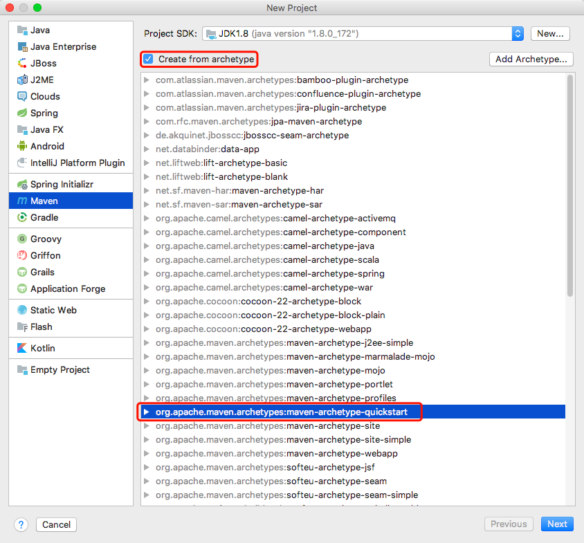

### ☀️ maven项目中的build标签

+ 关键字

  `如何创建Maven项目`、`build标签`

+ 记录

  不使用模板创建maven项目时，pom.xml文件中不会生成build标签，编译时会报警告，所以以后创建非web项目时，使用maven模板创建：

   


---

### ☀️ maven项目导入依赖

> 在maven中导入依赖时，不知道怎么写依赖，可以在[MavenRepository](https://mvnrepository.com/)或[WebJar](https://www.webjars.org/)中查找依赖


---

### ☀️Failed to load class "org.slf4j.impl.StaticLoggerBinder"

> 有些插件使用了`slf4j`日志框架，但是该框架可能会报标题所示错误

在maven中导入如下依赖即可：

```xml
<dependency>
    <groupId>org.slf4j</groupId>
    <artifactId>slf4j-simple</artifactId>
    <version>1.7.7</version>
</dependency>
```

---

### ☀️shiro导致springboot事务不起效解决办法

> 该问题是shiro比spring先启动，导致shiro的自定义realm中注入的service层无法交给spring管理导致；有3种解决方案
1. shiro的自定义realm中不注入service，注入dao
    > shiro的自定义realm中无法使用事务
2. shiro的自定义realm中注入的service上使用`@Lazy`注解，将该service对象使用懒加载，亲测有效
3. 创建监听器，等spring接在完成后再加载shiro，参见[shiro导致springboot事务不起效解决办法](https://blog.csdn.net/yucaifu1989/article/details/79206369)

---

### ☀️JSONObject转String保留值为NULL的项

```Java
JSONObject jsonObject = new JSONObject();
System.out.println(JSON.toJSONString(jsonObject,SerializerFeature.WriteMapNullValue));
```


