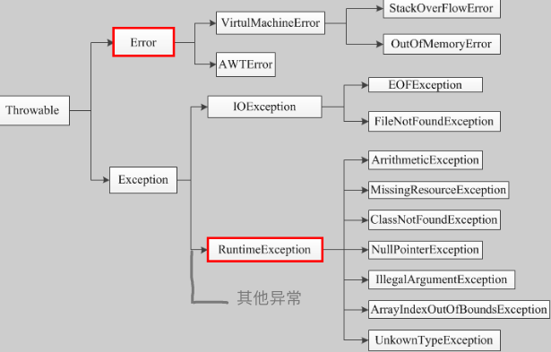
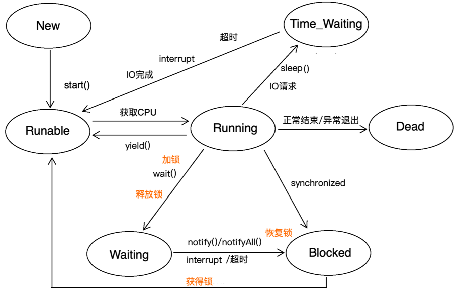

# java基础

## 重写

+ 参数列表必须完全相同

+ 返回值类型是被重写方法的返回值类型，或其子类

  ```java
  public class OverrideTest extends Test{
      @Override
      Long test1(Long id) {
          return id;
      }
  }
  
  class Test{
      Object test1(Long id){
          return 0L;
      }
  }
  ```

+ 重写方法的访问权限不能低于被重写方法的访问权限

  被重写方法的访问权限为protected，重写方法必须为protected或public

  权限由高到低：public、protected、未指定、private

+ 父类的方法可以被子类或孙子类等重写，不是只有子类可以重写

+ final、private、static、构造方法永远不能被重写

  未指定访问权限的方法能否被重写取决于父子类是否在同一个包中，同一包中可以重写，否则不能重写

+ 重写方法可以抛出任意非强制性异常，但是只能抛出小于等于被重写方法的强制性异常

## 重载

+ 必须修改参数列表
+ 可以修改返回值类型、访问修饰符、强制性异常
+ 可以在子类中重载

## 异常

### Throwable

  

+ Error

  即使被异常处理器捕获了，也无法进行有效处理，保证程序正产运行的问题，被定义为错误

  程序中不必对错误进行处理，因为程序处理不了

+ RuntineException

  运行时异常，一般是代码写的不好导致的，这类异常可以通过修改代码完全杜绝的，不应该通过异常处理器解决

+ 其他异常（包括IOException）

  这类异常是无法通过代码完全杜绝的，但是可以通过异常处理器进行有效处理，保证程序正常运行

  这类异常必须通过异常处理器处理

### 异常分类

+ 非检查异常/强制性异常

  + 非检查异常的意思是，不应该通过异常处理器解决的异常；这类异常也叫非强制性异常，因为这类异常不是必须通过异常处理器处理的
  + 这类异常包括：Error、RuntineException

+ 检查异常/强制性异常

  除`Error`和`RuntimeException`之外的异常都是检查异常，也叫强制性异常，这类异常必须通过异常处理器处理

### 何时导致程序停止

所有的异常，如果抛到`jvm`层面了，程序就会停止

# java高级编程

> 参考资料
>
> + [菜鸟教程](http://www.runoob.com/java/java-data-structures.html) 

## 多线程

> 参考资料：
>
> + [Java中的多线程你只要看这一篇就够了](https://www.cnblogs.com/wxd0108/p/5479442.html)
> + [Java总结篇系列：Java多线程（一）](https://www.cnblogs.com/lwbqqyumidi/p/3804883.html) 

### 概念

+ 多线程

  指的是这个程序（一个进程）运行时产生了不止一个线程

+ 并行与并发

  + 并行

    **多个cpu**实例或者**多台机器**同时执行一段处理逻辑，是真正的同时

  + 并发

    通过cpu调度算法，让用户看上去同时执行，实际上从cpu操作层面不是真正的同时。

    并发往往在场景中有公用的资源，那么针对这个公用的资源往往产生瓶颈，我们会用TPS或者QPS来反应这个系统的处理能力。

+ 线程安全

  ​	线程安全经常用来描绘一段代码。指在并发的情况之下，该代码经过多线程使用，线程的调度顺序不影响任何结果。反过来，线程不安全就意味着线程的调度顺序会影响最终结果，如不加事务的转账代码：

  ```java
  void transferMoney(User from, User to, float amount){
    to.setMoney(to.getBalance() + amount);
    from.setMoney(from.getBalance() - amount);
  }
  ```

  > 如果两个线程同时调用这段代码，如同时执行到`to.setMoney(to.getBalance() + amount);`这句，线程1执行`getBalance()`之后，执行`setMoney()`之前，线程2执行了`getBalance()`，则线程1、2执行的`getBalance()`会得到相同的结果，然后线程1、2分别加上`amount`后执行`setMoney()`，则最终的结果就是只有1个线程中的`amount`被加上了，而应该得到的结果是线程1、2的`amount`都加上

+ 同步

  Java中的同步指的是通过人为的控制和调度，保证共享资源的多线程访问成为线程安全，来保证结果的准确。如上面的代码简单加入`synchronized`关键字

  ```java
  void transferMoney(User from, User to, float amount){
      synchronized (to) {
          to.setMoney(to.getMoney() + amount);
      }
      synchronized (from) {
          from.setMoney(from.getMoney() - amount);
      }
  }
  ```

### 同步锁

#### 锁类型

+ 可重入锁

  + 线程获取到1个锁之后，释放锁之前，再次申请获取同一个锁，线程会忽略内部的锁，直接执行内部锁保护的内容，这样的锁叫可重入锁

  + 非可重入锁会造成死锁

  + 示例

    ```java
    public class ReentrantLockTest {
        synchronized void method1(){
            method2();          // 调用 method2 时，因为 this对象已经被当前线程锁住，
                                // 所以不会再次获取该锁，直接执行method2
        }
        synchronized void method2(){
        }
    }
    ```

+ 可中断锁

  等待获取锁的过程可以被打断的锁

+ 公平锁

  等待时间越长，获取锁的优先级越高的锁

+ 读写锁

  读写文件时，读与写的操作互斥，写于写互斥，但是读与读之间不互斥得锁

#### synchronized

>  参见[Java中synchronized的用法](http://www.importnew.com/21866.html) 

+ 功能

  当执行到关键字`synchronized`时，会先判断`()`内的对象是否已经被其他锁锁住；

  如果被锁住了，则等待该对象解锁

  如果/等到对象处于未被锁定的状态，则锁定该对象，执行`{}`内的代码，执行结束后释放锁

+ 使用方法

  `synchronized`有多种使用方法
  + 作用于代码块

    语法：synchronized( this ) { }

    ()内的**对象**被其他锁锁住时，不执行{}内的代码，等待解锁

  + 作用于方法

    语法：synchronized void method(){}

    相当于方法内的所有代码外加上synchronized( this ) { }

  + 作用于静态方法

    语法：synchronized static void method(){}

    也相当于方法内的所有代码外加上synchronized( this ) { }

    但是不同对象的静态方法的this引用是相同的，所以不同对象调用这个静态方法时是互斥的

  + 作用于类

    语法：synchronized( A.class ) { }

    该类的所有对象都使用同一把锁

#### lock()

> 参考资料：
>
> + [详解synchronized与Lock的区别与使用](https://blog.csdn.net/u012403290/article/details/64910926) 
> + [Lock和synchronized的区别和使用](https://www.cnblogs.com/baizhanshi/p/6419268.html) 

+ `synchronized`的缺陷

  - A线程获取到锁了，B线程等待A释放锁，如果A一直不释放，则B会一直等下去，影响执行效率
  - 读写文件时，读与写的操作应该互斥，写于写应该互斥，但是读与读之间没必要互斥，但是使用`synchronized`读与读操作也是互斥的，影响效率

  - `synchronized`无法获取到锁的状态，无法根据锁的状态决定执行哪些操作

  `lock()`锁解决了这些缺陷

+ 使用方法

  + Lock接口

    ```java
    package java.util.concurrent.locks;
    public interface Lock {
        // 等待获取锁
        void lock();
        // 等待获取锁，等待状态可以被interrupt
        void lockInterruptibly() throws InterruptedException;
        // 尝试获取锁，返回是否获取成功
        boolean tryLock();
        // 在指定时间内尝试获取锁，指定时间内，一旦获取到锁立即返回true，超时没有获取到锁，则返回false，
        boolean tryLock(long time, TimeUnit unit) throws InterruptedException;
        // 释放锁
        void unlock();
        Condition newCondition();
    }
    ```

  + 使用示例

    ```java
    class LockThread implements Runnable {
        public static User1 from = new User1();
        // 注意 Lock 对象的定义方式及位置，同一个lock对象之间的锁是互斥的，否则互不影响
        private Lock lock = new ReentrantLock();
    
        @Override
        public void run() {
            for (int i = 0; i < 50; i++) {
                transferMoney(from,5.0f);
            }
        }
    
        private void transferMoney(User1 from, float amount){
            lock.lock();
            try {
                from.setMoney(from.getMoney() + amount);
            } catch (Exception e) {
                e.printStackTrace();
            } finally {
                lock.unlock();
            }
        }
    }
    ```

  + 注意

    + 注意 Lock 对象的定义方式及位置，同一个lock对象之间的锁是互斥的，否则互不影响
    + `unlock()`必须放在`finally`中执行，否则会造成死锁

+ 读写锁

  + `ReadWriteLock`接口

    ```java
    public interface ReadWriteLock {
    	// 获取读锁
        Lock readLock();
    	// 获取写锁
        Lock writeLock();
    }
    ```

  + `ReentrantReadWriteLock`实现类

    `ReadWriterLock`接口的实现类，使用实例如下：

    ```java
    class ReadThread implements Runnable{
        // 这里必须使用 ReadWriteLock 接收，不能再使用 Lock
        ReadWriteLock lock = new ReentrantReadWriteLock();
    
        @Override
        public void run() {
            for(int i=0; i<5; i++){
                read();
            }
        }
    
        public void read(){
            lock.readLock().lock();
            try{
                // 执行读
            }finally {
                lock.readLock().unlock();
            }
        }
    }
    ```

+ 公平锁

  `ReentrantReadWriteLock`和`ReentrantLock`默认都是非公平锁，但是可以通过构造方法指定是否使用公平锁，例：

  ```java
  Lock lock = new ReentrantLock();						// 非公平锁
  Lock lock = new ReentrantLock(false);					// 非公平锁
  Lock lock = new ReentrantLock(true);					// 公平锁
  ReadWriteLock lock = new ReentrantReadWriteLock();		// 非公平锁
  ReadWriteLock lock = new ReentrantReadWriteLock(false);	// 非公平锁
  ReadWriteLock lock = new ReentrantReadWriteLock(true);	// 公平锁
  ```

#### synchronized、locked()区别

|  类别  |                         synchronized                         |                    lock                     |
| :----: | :----------------------------------------------------------: | :-----------------------------------------: |
|  类型  |                            关键字                            |                     类                      |
| 释放锁 | 执行完同步代码自动释放锁<br />同步代码发生异常，jvm让线程释放锁 | 在finally中必须释放锁，不然容易造成线程死锁 |
| 获取锁 |                         只有1种方式                          |              多种获取锁的方式               |
| 锁状态 |                     无法判断锁是否被占用                     |                  可以判断                   |
| 锁类型 |               可重入、不可中断、非公平、非读写               |     可重入、可中断、可以公平、可以读写      |
|  性能  |                             较低                             |                    较高                     |

### 线程生命周期

     

线程的生命周期中包含5种状态：

+ **新建状态（New）：**当线程对象对创建后，即进入了新建状态，如：Thread t = new MyThread();

+ **就绪状态（Runnable）：**当调用线程对象的start()方法（t.start();），线程即进入就绪状态。处于就绪状态的线程，只是说明此线程已经做好了准备，随时等待CPU调度执行，并不是说执行了t.start()此线程立即就会执行；

+ **运行状态（Running）：**当CPU开始调度处于就绪状态的线程时，此时线程才得以真正执行，即进入到运行状态。注：就     绪状态是进入到运行状态的唯一入口，也就是说，线程要想进入运行状态执行，首先必须处于就绪状态中；

+ **阻塞状态（Blocked）：**处于运行状态中的线程由于某种原因，暂时放弃对CPU的使用权，停止执行，此时进入阻塞状态，直到其进入到就绪状态，才 有机会再次被CPU调用以进入到运行状态。根据阻塞产生的原因不同，阻塞状态又可以分为三种：

  + 同步阻塞（Blocked）：

    线程获取同步锁（synchronized）失败，则进入阻塞态，等待锁被释放后重新进入就绪态

    >  之所以叫做同步阻塞态，估计是该线程一边阻塞着，一边定期尝试获取同步锁

  + 异步阻塞（Time_Waiting）:

    线程中执行了sleep、请求IO时，线程就会进入异步阻塞状态，等到满足超时、interrupt、IO完成等条件时，就会被异步唤醒，进入就绪态

  + 等待阻塞（Waiting）：

    + 该状态本身与`Time_Waiting`状态没什么区别，只不过因为wait()必须放在同步代码块中执行（为什么参见[wait、notify、notifyAll必须位于synchronized代码块](#wait、notify、notifyAll必须位于synchronized代码块)），wait()在进入阻塞态时释放了锁，被唤醒后需要恢复锁，所以需要再经历一次`Blocked`状态，才把wait()经历的阻塞态单独表示出来的

    + 上图中`Running → Waiting → Blocked → Runable `的过程参见如下代码

      ```java
      						// Running状态
      synchronized (obj){	// 加锁
          obj.wait();				// 进入 Waiting 状态，并释放锁
          					// 被唤醒后，尝试恢复锁，没恢复之前处于 Blocked 状态
          					// 获得锁后，进入Runable状态
      }
      ```

+ **死亡状态（Dead）：**线程执行完了或者因异常退出了run()方法，该线程结束生命周期。

### 同步、异步、阻塞、非阻塞

> 参见[一文读懂并发与并行，同步阻塞与异步阻塞](https://cloud.tencent.com/developer/news/257034) 

+ 同步

  主动去查询是否满足条件

+ 异步

  被通知是否满足条件

+ 阻塞

  没满足条件之前什么都不做，就等着，直到满足条件继续执行

+ 非阻塞

  没满足条件之前先去做别的，满足条件再回来继续执行

+ 同步阻塞

  当前线程无法继续执行，需要暂停时，进入阻塞态，不去执行其他任务，不断的查询是否满足继续运行的条件，直到满足条件继续执行

+ 同步非阻塞

  当前线程无法继续执行，需要暂停时，先去执行其他任务，并且定期查询是否满足继续运行的条件，直到满足条件回来继续执行当前线程

+ 异步阻塞

  当前线程无法继续执行，需要暂停时，进入阻塞态，不去执行其他任务，等待被通知满足继续执行的条件后继续执行当前线程

+ 异步非阻塞

  当前线程无法继续执行，需要暂停时，先去执行其他任务，等到被通知满足继续执行的条件后回来继续执行当前线程

### 常用方法

#### 方法介绍

##### Thread类

+ start

  + 语法

    ```java
    public synchronized void start()
    ```

  + 功能：使线程进入`Runable`状态

+ sleep

  + 语法

    ```java
    public static native void sleep(long millis);
    public static void sleep(long millis, int nanos);
    ```

  + 功能：使当前线程进入阻塞态，直到超时或被interrupt唤醒

  + 说明：
    + sleep方法不能被notify()唤醒
    + 进入阻塞态时不会释放同步锁

+ join

  + 语法

    ```java
    public final void join();
    public final synchronized void join(long millis);
    public final synchronized void join(long millis, int nanos);
    ```

  + 功能：使当前线程进入阻塞态，直到被notify、超时、调用者线程结束、interrupt唤醒

  + 例

    ```java
    t.join();	// 当前线程进入阻塞态，直到线程t结束
    ```

  + 说明

    + join的实现方法是，在当前线程执行wait()，直到调用者线程结束调用notify()唤醒当前线程，所以join()能被notify唤醒，进入阻塞态时也会释放同步锁

+ yield

  + 语法

    ```java
    public static native void yield();
    ```

  + 功能：使当前线程重新进入`Runable`状态

+ interrupt

  + 语法

    ```java
    public void interrupt()
    ```

  + 功能：

    如果调用方线程处于异步阻塞态，则立即唤醒该线程，并设置该线程的中断信号

    如果调用方线程处于运行态，则设置该线程的中断信号

  + 说明

    线程被设置中断信号后，不会有任何影响，只有在`run`方法中对中断信号进行处理后这个中断才有作用

##### Object类

+ wait
  + 语法

    ```java
    void wait();
    void wait(long timeout);
    void wait(long timeout, int nanos);
    ```

  + 功能：使当前线程进入阻塞态，直到被nofity、interrupt、超时唤醒

  + demo

    ```java
    // 调用wait的代码
    synchronized (obj){
        obj.wait();
    }
    // 调用notify的代码
    synchronized (obj){
        obj.notify();		// 这里的obj需要与上面的obj是同1个对象才会被唤醒
    }
    ```

  + 说明：

    + 进入`Waiting`阻塞态同时释放同步锁，唤醒后需要恢复同步锁
    + 必须位于同步代码块中，原因参见[wait、notify、notifyAll必须位于synchronized代码块](#wait、notify、notifyAll必须位于synchronized代码块) 
    + 调用`wait`的对象必须是被`synchronized`锁住的对象

+ notify

  + 语法

    ```java
    void notify();
    ```

  + 功能：随机唤醒1个锁住调用者对象的，处于`Waiting`阻塞态的线程

  + 说明：

    + 必须用于同步代码块，原因参见[wait、notify、notifyAll必须位于synchronized代码块](#wait、notify、notifyAll必须位于synchronized代码块) 
    + 调用`notify`的对象必须是被`synchronized`锁住的对象

+ notifyAll

  - 语法

    ```java
    void notifyAll();
    ```

  - 功能：唤醒所有锁住调用者对象的，处于`Waiting`阻塞态的线程

  - 说明：

    - 必须用于同步代码块，原因参见[wait、notify、notifyAll必须位于synchronized代码块](#wait、notify、notifyAll必须位于synchronized代码块) 
    - 调用`notifyAll`的对象必须是被`synchronized`锁住的对象

#### sleep与wait区别

> 参见[Java线程阻塞方法sleep()和wait()精炼详解](https://blog.csdn.net/weixin_41101173/article/details/79889464) 

|   类型   |    sleep     |            wait            |
| :------: | :----------: | :------------------------: |
|    类    |    Thread    |           Object           |
| 时间参数 | 必须设置时间 | 可以设置时间，也可以不设置 |
|  释放锁  |   不释放锁   |           释放锁           |
|   使用   |   任意地方   |       仅限同步代码块       |

#### wait、notify、notifyAll必须位于synchronized代码块

monitor：Java中的每个对象都有一个监视器，来监测并发代码的重入。在非多线程编码时该监视器不发挥作用，反之如果在synchronized 范围内，监视器发挥作用。

wait/notify必须存在于synchronized块中。并且，这三个关键字针对的是同一个监视器（某对象的监视器）。这意味着wait之后，其他线程可以进入同步块执行。

当某代码并不持有监视器的使用权时去wait或notify，会抛出java.lang.IllegalMonitorStateException。也包括在synchronized块中去调用另一个对象的wait/notify，因为不同对象的监视器不同，同样会抛出此异常。

### volatile


## 集合

### 获得线程安全集合

使用`Collections.synchronizedxxx()`方法获得，如：

```java
Map<String,Object> map = Collections.synchronizedMap(new HashMap<>());
```

### hashMap

+ JDK1.7及以前版本，hashMap的实现方式为：数组 + 单向链表

+ JDK1.8及以后版本，hashMap的实现方式为：数组 + 单向链表 + 红黑树

  链表长度大于8时，转换为红黑树


