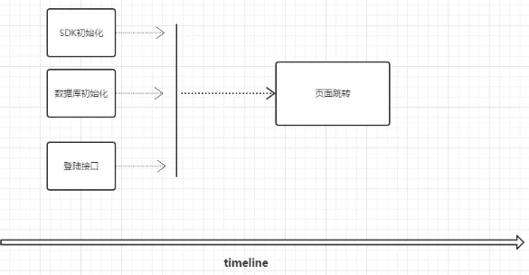

# 响应式编程reactive

## 什么是响应式编程

> 参见：[重新理解响应式编程](https://www.jianshu.com/p/c95e29854cb1) 

​	响应式编程是一种**通过异步和数据流来构建事务关系的编程模型**。这里每个词都很重要，“事务的关系”是响应式编程的核心理念，“数据流”和“异步”是实现这个核心理念的关键。

​	举例说明，如下图：

​	 

​	前面3个动作执行完，才执行页面跳转

+ 事务关系

  + 事务

    这里的事务可以理解为业务，如上图中的每个动作都是1个事务

  + 事务关系

    指的是业务之间的关系，如上图，前三个事务之间相互独立，`页面跳转`依赖于前三个事务，这就是这4个事务之间的关系

+ 数据流

  数据流是沟通事务之间的桥梁

  上游的事务执行完需要通知下游的事务，如`sdk初始化`执行完需要通知`页面跳转`，数据流其实就是一条数据（一个事件）

+ 异步

  就是多个事务同时执行

## 响应式编程入门

> 参见：[响应式编程系列（一）：什么是响应式编程？reactor入门](https://www.cnblogs.com/yuanrw/p/10050509.html)  

### 我的理解

​	     响应式编程类似于`回调`或`nodejs中的async/await`

​	传统的调用是，执行1个打开文件的操作，在内容返回之前，线程只能阻塞

​	响应式编程是，执行1个打开文件的操作，内容返回之前我可以去做其他事，内容返回之后通过事件通知等方式继续回来执行该线程的内容