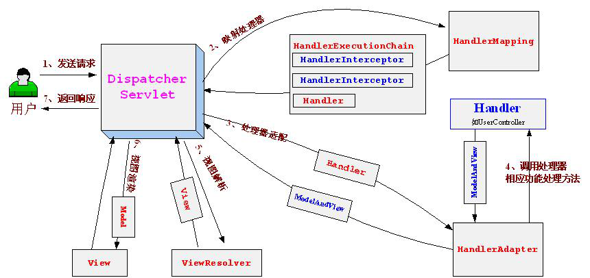

# 设计模式

## OOAD

### OOA

+ 面向对象分析

+ UML类图，用于描述类之间得关系

  + 类

      

  + 接口

      

+ 关系

  > 由上至下，由强至弱

  + 依赖关系：局部变量
  + 关联关系：成员变量
  + 实现关系：实现接口
  + 泛化关系：继承父类

### OOD

+ 面向对象设计
+ `OOA`侧重于描述业务问题，`OOD`在`OOA`基础上结合技术细节设计出一套可落地的解决方案

## 7大设计原则

> 口诀：合理的揭开一单（谐音）

| 设计原则名称                                       | 定义                                              | 使用频率 |
| -------------------------------------------------- | ------------------------------------------------- | -------- |
| 单⼀职责原则(Single Responsibility Principle, SRP) | ⼀个类只负责⼀个功能领域中的相应职责              | ★★★★☆    |
| 开闭原则(Open-Closed Principle, OCP)               | 软件实体应对扩展开放，⽽对修改关闭                | ★★★★★    |
| ⾥⽒代换原则(Liskov Substitution Principle, LSP)   | 所有引⽤基类对象的地⽅能够透明地使 ⽤其⼦类的对象 | ★★★★★    |
| 依赖倒转原则(Dependence Inversion Principle, DIP)  | 抽象不应该依赖于细节，细节应该依赖 于抽象         | ★★★★★    |
| 接⼝隔离原则(Interface Segregation Principle, ISP) | 使⽤多个专⻔的接⼝，⽽不使⽤单⼀的 总接⼝         | ★★☆☆☆    |
| 合成复⽤原则(Composite Reuse Principle, CRP)       | 尽量使⽤对象组合，⽽不是继承来达到 复⽤的⽬的     | ★★★★☆    |
| 迪⽶特法则(Law of Demeter, LoD)                    | ⼀个软件实体应当尽可能少地与其他实 体发⽣相互作⽤ | ★★★☆☆    |

## 常见设计模式

### 工厂

+ 简单工厂
  + 只能生产一种对象
  + 一个类中的方法只能生产固定型号手机
+ 工厂方法：
  + 可以生产多种对象
  + 定义好1个接口用于生产手机，不用厂商实现类实现该接口，生产各自品牌的手机
+ 抽象工厂
  + 可以生产多个系列的对象
  + 在工厂方法基础上，每个厂商实现类可以生产多种手机配件

### 单例

+ 优点：方便管理、节省性能
+ 实现方式
  + 静态内部类
  + 枚举
  + 双重检查锁（变量要加`volatile`，禁止指令重排）

### 委托

+ 把不同的任务交给擅长的人去做

+ `DispatcherServlet`使用了委托模式

   

### 代理

+ 把任务全权交给其他人负责
+ 案例：AOP
+ 实现方式
  + JDK动态代理：必须实现接口，父子关系
  + CGLib动态代理：生成目标类子类，

### 责任链

+ 过滤器

### 构造者

+ 用于构造参数形式或过程比较复杂得情况
+ 构造方法传入`Builder`对象，静态内部类`Builder`类，`set`方法传入属性，`build`方法调用原有类构造方法传入`builder`类，返回原有类对象

### 适配器

+ 避免写`if...else...`
+ `supports`方法用于匹配

# spring

## 请求处理流程

见[委托](#委托) 

## AOP

+ 使用动态代理技术，在执行`InvocationHandler`的`invoke`方法前后加入要执行的代码

# 线程安全

## volatile

+ 作用
  + 保证内存可见性
  + 禁止指令重排
+ 原理
  + 每次读取从主内存加载，修改之后同步到其他线程内存
  + 内存屏障禁止指令重排

## ConcurrentHashMap

+ 1.7：有固定数量得`Segment`，下面挂着哈希表，`segment`继承`ReentrantLock`，来保证线程安全
+ 1.8：数据结构同`HashMap`，通过`synchronized`和`CAS`保证线程安全

# 线程

## 进程线程区别`一个线程只可以属于一个进程，但一个进程能包含多个线程。

+ 线程无地址空间，它包括在进程的地址空间里。
+ 线程的开销或代价比进程的小

## 创建线程方法

Thread、Runable、Callable、线程池

## 进程、线程通信方式

+ 进程
  + 
+ 线程

# 内存

## 内存溢出、内存泄漏

+ 内存泄漏指的是申请完得内存无法回收，内存泄漏过多会导致内存溢出
+ 内存溢出指的是内存用尽，无法再申请
+ 造成内存溢出原因
  + 对象没有释放，一直无法回收
  + 一次性读取了数据量特别大得数据
  + 内存设置过小

## 深拷贝、浅拷贝

+ 浅拷贝

  + 实现`Cloneable`接口，重写`clone`方法，调用父类`colone`方法

     

+ 深拷贝

  + 系列化并反序列化

  + 实现`Cloneable`接口，重写`clone`方法，调用父类`colone`方法并强转为当前对象，并调用属性`clone`方法赋值给当前对象

     

